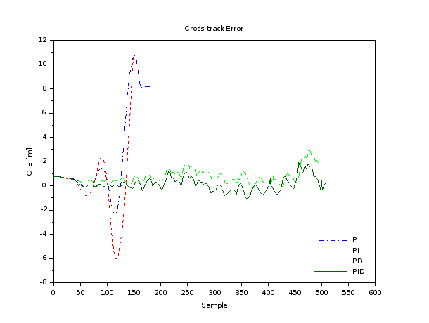
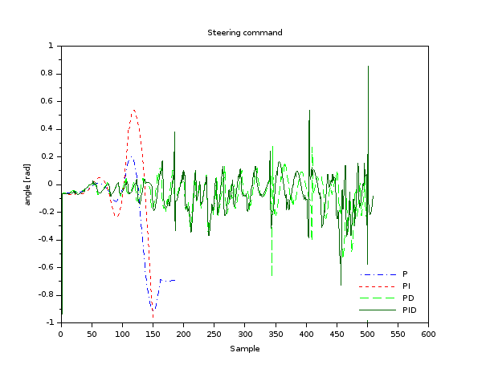

# UDACITY Self-Driving Car Nanodegree Program
## PID steering and speed control for autonomous vehicles

In this project, we utilized the classic PID control approach to regulate the heading and speed of an autonomous vehicle (AV).

PID stands for Proportional-Integral-Derivative. Each term relates to the operation the controller executes on the process error (i.e., err = reference value - process variable value) to compute the control command. That is, the control command u is obtained as u = Kp * err + Ki * Int{err * dt} + Kd * derr/dt, where Int{} is the integral and d/dt the derivative of the error. 
The proportional term accounts for the actual values of the process error, the integral term looks after the evolution of this error with time, and the derivative term foresees the future values of the error based on its changing rate. The effect on the control command of each operation is regulated by the proportional Kp, integral Ki, and derivative Kd gains. Therefore, these gains should be appropriately tuned so as to obtain the required system response. There exist different methodologies that guide us on the tuning process of the gains. In this project, we chose our control gains solely based on the lazy/simple trial and error approach to achieve an admissible (safe in our case) performance.

Based on the vehicle [simulator](https://github.com/udacity/self-driving-car-sim/releases) provided by Udacity, we evaluate different combinations of the PID operations (i.e., P, PI, PD, PID) for the steering control of our AV to illustrate the effect of each term. The results are illustrated in the figures below. Note that our gains are fixed as Kp = 0.085, Ki = 10.5E-4, and Kd = 1.15 and applied according to the studied P-I-D combination.

 

From these results, it is clear that the proportional and proportional-integral controllers are not able to provide safe steering commands to keep our autonomous vehicles on the track. Whereas, the proportional-derivative controller improves the steering response and reduces the cross-track error to accomplish a relatively safe driving performance. Ultimately, the PID controller surpasses the performance of the previous controllers and allows the AV to travel closer to the center of the lane (which served as our reference value).

The overall performance of our AV in the simulator track can be seen in the video below.

